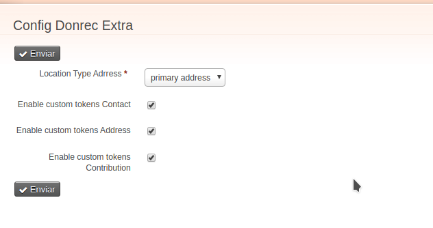

# Donor Receipt Extras

This extension extends functionality provideed by [de.systopia.donrec](https://github.com/systopia/de.systopia.donrec)

## Requirements

* PHP 8.1
* CiviCRM 5.69

## Configuration

* Please access url `civicrm/admin/donrecextra` to configure available tokens



## Usage

The donation receipts generated by extension `de.systopia.donrec` are based on Smarty, this extension adds new tokens that
can be included in this Smarty templates, for example:


* Example for contributions details

  ```smarty
  {foreach from=$lines item=line}
    {$line.receive_date}
    {$line.custom_xx}
  {/foreach}
  ```

* Example for a contribution sum from a custom field

  ```smarty
  {foreach from=$lines item=line key=tasknum  name=foo}
    {assign var="sum_all_foreach" value=$sum_all_foreach+$line.custom_23}
  {/foreach}
  {$sum_all_foreach|string_format:"%.2f"}
  ```

* Example for contacts' custom fields

  ```Smarty
  {$contributor.custom_xx}
  ```

## Special tokens

```Smarty
{$contributor.individual_prefix}
```

* Address, with criteria admin configuration page

```Smarty
{$address.state_province_name}
{$address.state_province_abbreviation}
{$address.country}
{$address.state_province_id}
{$address.supplemental_address_1}
{$address.supplemental_address_2}
{$address.city}
{$address.postal_code}
{$address.id}
{$address.custom_xx}
```

* Available Contribution Tokens

```Smarty
{$line.accounting_code}
{$line.amount_level}
{$line.cancel_date}
{$line.cancel_reason}
{$line.campaign_id}
{$line.check_number}
{$line.contribution_batch}
{$line.contribution_campaign_id}
{$line.contribution_campaign_title}
{$line.contribution_cancel_date}
{$line.contribution_check_number}
{$line.contribution_id}
{$line.contribution_note}
{$line.contribution_recur_id}
{$line.contribution_recur_status}
{$line.contribution_source}
{$line.contribution_status}
{$line.contribution_status_id}
{$line.contribution_type_id}
{$line.currency}
{$line.custom_xx}
{$line.fee_amount}
{$line.financial_account_id}
{$line.financial_type}
{$line.financial_type_id}
{$line.instrument_id}
{$line.invoice_id}
{$line.invoice_number}
{$line.is_pay_later}
{$line.is_test}
{$line.net_amount}
{$line.non_deductible_amount}
{$line.payment_instrument}
{$line.payment_instrument_id}
{$line.receive_date}
{$line.receipt_date}
{$line.thankyou_date}
{$line.total_amount}
{$line.trxn_id}
```
